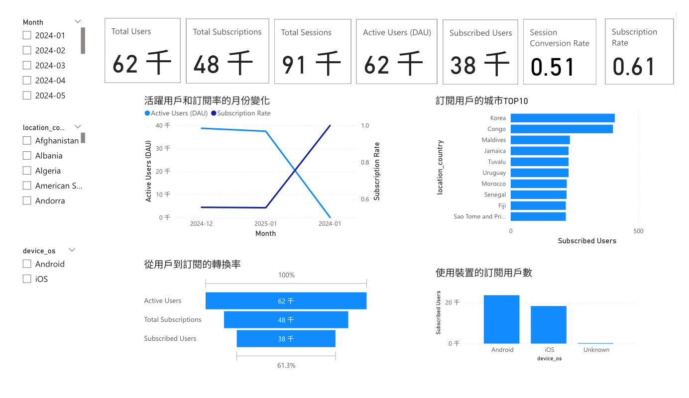

📱 User Mobile App Behavior Analysis

本專案使用 Kaggle User Mobile App Interaction Data。
目標是找出影響轉換的關鍵互動行為（Key interaction behaviors leading to conversion）。

📂 專案結構
user-app-behavior-analysis/
│── data/
│   ├── user_mobile_app_interaction_data.csv   # 原始 Kaggle 資料（需自行下載，已 .gitignore）
│   └── processed_app_interactions.csv         # 清理後的資料（已附）
│── notebooks/
│   ├── 00_cleaning.ipynb   # 資料清理流程（型別轉換、缺失值處理、異常值處理）
│   ├── 01_EDA.ipynb        # 探索性資料分析 (EDA)
│── scripts/                # 預留 ETL / feature 工具程式
│── reports/                # 圖表與分析文件
│── schema.md               # 欄位設計與數據字典
│── requirements.txt
│── README.md

🚀 使用方式
1. 下載資料

到 Kaggle 下載原始資料集：User Mobile App Interaction Data
放到 data/ 資料夾下，命名為：

data/user_mobile_app_interaction_data.csv

2. 建立虛擬環境並安裝套件
python -m venv venv
venv\Scripts\activate   # Windows
# source venv/bin/activate   # Mac/Linux

pip install -r requirements.txt

3. 跑資料清理
jupyter lab notebooks/00_cleaning.ipynb

會輸出：

data/processed_app_interactions.csv

4. 跑 EDA 分析
jupyter lab notebooks/01_EDA.ipynb

📊 儀表板成果 (Power BI)

- **KPI 總覽**：Total Users / Sessions / Subscriptions / DAU / Subscription Rate  
- **趨勢分析**：活躍用戶數 & 訂閱率 隨時間變化  
- **分群比較**：不同國家 (Top 10) 與裝置 (OS) 的轉換率差異  
- **漏斗分析**：Active Users → Subscribed Users (~61% 轉換率)  

📷 Dashboard 截圖：  

📑 [投影片下載 (PPTX)](reports/app_user_conversion_overview.pptx)

📝 備註

data/user_mobile_app_interaction_data.csv 不會上傳到 GitHub（已 .gitignore），需自行下載

data/processed_app_interactions.csv 已包含在 repo 中，可直接使用
